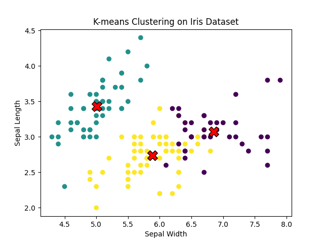
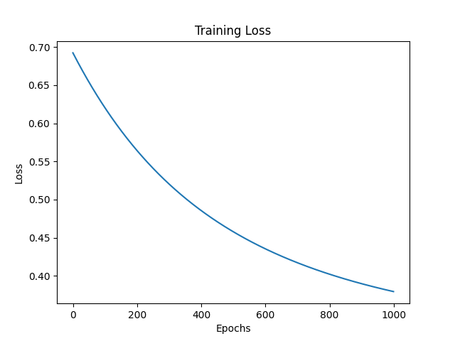
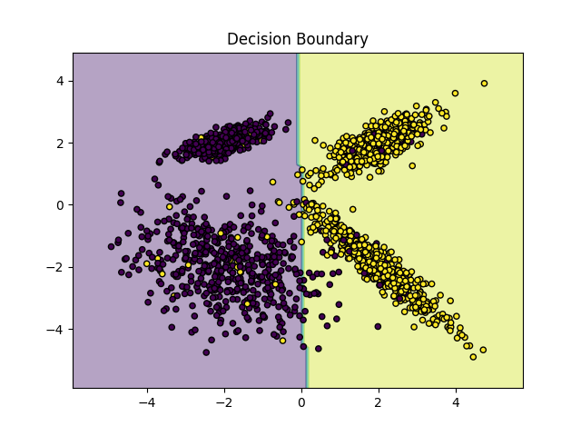

# SmartAlgo: Облегченная библиотека машинного обучения  

`SmartAlgo` — это Python-пакет с реализацией основных алгоритмов машинного обучения "с нуля". Разработан в целях обучения, включает линейную регрессию, k-средних и логистическую регрессию с L2-регуляризацией. Работает с минимальными зависимостями (`numpy` и `scipy`), идеально подходит для изучения основ ML.  

## Установка  

Установите пакет через pip:  

```bash  
pip install sm_algo  
```  

**Зависимости:**  
- numpy
- scipy  

## Алгоритмы  

### 1. Линейная регрессия с градиентным спуском  
**Класс:** `LinearRegression`  
Линейная регрессия, обученная методом градиентного спуска.  

**Параметры:**  
- `learning_rate` (float, по умолчанию=0.01): Шаг градиентного спуска.  
- `epochs` (int, по умолчанию=1000): Количество итераций обучения.  

**Методы:**  
- `fit(X, y)`: Обучает модель на данных `X` и целевых значениях `y`.  
- `predict(X)`: Возвращает предсказания для входных данных `X`.  

**Пример:**  
```python  
from sm_algo.linreg import LinearRegression
from sklearn.datasets import load_diabetes
from sklearn.model_selection import train_test_split
from sklearn.metrics import mean_squared_error, r2_score
from sklearn.preprocessing import StandardScaler


# Загрузка датасета diabetes из sklearn
data = load_diabetes()
X, y = data.data, data.target  # X - признаки, y - целевая переменная

# Разделение данных на обучающую и тестовую выборки (80% / 20%)
X_train, X_test, y_train, y_test = train_test_split(
    X, y, test_size=0.2, random_state=42  # random_state для воспроизводимости
)

# Нормализация данных (приведение к нулевому среднему и единичной дисперсии)
scaler = StandardScaler()
X_train = scaler.fit_transform(X_train)  # обучение scaler и трансформация тренировочных данных
X_test = scaler.transform(X_test)  # трансформация тестовых данных (без повторного обучения)

# Создание и обучение модели линейной регрессии
model = LinearRegression(learning_rate=0.1, epochs=1000)  # задаем скорость обучения и кол-во эпох
model.fit(X_train, y_train)  # обучение модели на тренировочных данных

# Получение предсказаний на тестовых данных
y_pred = model.predict(X_test)

# Оценка качества модели:
# - MSE (среднеквадратичная ошибка, чем меньше - тем лучше)
# - R² (коэффициент детерминации, 1 - идеальное предсказание)
print(f"MSE: {mean_squared_error(y_test, y_pred):.2f}")
print(f"R²: {r2_score(y_test, y_pred):.2f}")

# Вывод обученных весов модели
print("\nВеса модели:")
for i, w in enumerate(model.weights):
    print(f"Feature {i}: {w:.3f}")  # вес i-го признака
print(f"Intercept (bias): {model.bias:.3f}")  # свободный член (смещение)

# Для сравнения с реализацией линейной регрессии из sklearn
from sklearn.linear_model import LinearRegression as SklearnLR

sklearn_model = SklearnLR()  # создание модели sklearn
sklearn_model.fit(X_train, y_train)  # обучение
y_pred_sklearn = sklearn_model.predict(X_test)  # предсказание

# Вывод метрик sklearn модели для сравнения
print("\nSklearn Results:")
print(f"MSE: {mean_squared_error(y_test, y_pred_sklearn):.2f}")
print(f"R²: {r2_score(y_test, y_pred_sklearn):.2f}")
```  

```commandline
C:\Users\yashe\PycharmProjects\SmartAlgo\.venv\Scripts\python.exe C:\Users\yashe\PycharmProjects\SmartAlgo\test\linreg_test.py 
MSE: 2889.92
R²: 0.45

Веса модели:
Feature 0: 1.844
Feature 1: -11.477
Feature 2: 25.925
Feature 3: 16.727
Feature 4: -27.944
Feature 5: 11.731
Feature 6: 0.396
Feature 7: 10.872
Feature 8: 28.828
Feature 9: 2.471
Intercept (bias): 153.737

Sklearn Results:
MSE: 2900.19
R²: 0.45
```

### 2. Кластеризация K-средних  
**Класс:** `KMeans`  
Алгоритм K-средних с инициализацией центроидов методом k-means++.  

**Параметры:**  
- `n_clusters` (int, по умолчанию=8): Число кластеров.  
- `max_iter` (int, по умолчанию=300): Максимальное число итераций.  
- `tol` (float, по умолчанию=1e-4): Допуск для определения сходимости.  
- `random_state` (int, опционально): Seed для инициализации центроидов.  

**Методы:**  
- `fit(X)`: Выполняет кластеризацию для данных `X`.  
- `predict(X)`: Возвращает индексы кластеров для новых данных.  

**Пример:**  
```python  
from sklearn.datasets import load_iris
from sm_algo.kmeans import KMeans
import matplotlib.pyplot as plt


# Загрузка данных Iris (150 samples, 4 features)
iris = load_iris()
X = iris.data  # Данные в виде матрицы [150x4]

# Создание модели с 3 кластерами (по числу видов ирисов)
kmeans = KMeans(n_clusters=3)

# Обучение модели на масштабированных данных
kmeans.fit(X)

# Получение меток кластеров для каждой точки
labels = kmeans.labels_

# Рисуем точки по первым двум признакам, раскрашивая по кластерам
plt.scatter(
    X[:, 0],  # Ось X: первый признак (длина чашелистика)
    X[:, 1],  # Ось Y: второй признак (ширина чашелистика)
    c=labels,        # Цвет точек = номер кластера
    cmap='viridis'   # Палитра цветов
)

# Рисуем центроиды
plt.scatter(
    kmeans.centroids[:, 0],  # X координата центроидов
    kmeans.centroids[:, 1],  # Y координата центроидов
    marker='X',              # Форма — крестик
    s=200,                   # Размер
    c='red',                 # Цвет
    edgecolor='black'        # Обводка
)

# Подписи осей и заголовок
plt.xlabel('Sepal Width')
plt.ylabel('Sepal Length')
plt.title('K-means Clustering on Iris Dataset')
plt.show()
```



### 3. Логистическая регрессия с L2-регуляризацией  
**Класс:** `LogisticRegressionRidge`  
Логистическая регрессия с L2-регуляризацией, обучение градиентным спуском.  

**Параметры:**  
- `learning_rate` (float, по умолчанию=0.01): Шаг градиентного спуска.  
- `lambda_` (float, по умолчанию=0.1): Сила L2-регуляризации.  
- `epochs` (int, по умолчанию=1000): Число итераций обучения.  
- `fit_intercept` (bool, по умолчанию=True): Добавлять ли свободный член.  
- `verbose` (bool, по умолчанию=False): Вывод лога потерь каждые 100 эпох.  

**Методы:**  
- `fit(X, y)`: Обучает модель.  
- `predict_proba(X)`: Возвращает вероятности классов.  
- `predict(X, threshold=0.5)`: Возвращает метки классов.  

**Пример:**  
```python  
from sm_algo.logisticreg import LogisticRegressionRidge
from sklearn.metrics import accuracy_score
from sklearn.datasets import make_classification
from sklearn.model_selection import train_test_split
import matplotlib.pyplot as plt
import numpy as np


def score(model, X, y, threshold=0.5):
    """
    Вычисляет точность (accuracy) модели.

    Параметры:
    ----------
    X : ndarray, shape (n_samples, n_features)
        Матрица признаков.
    y : ndarray, shape (n_samples,)
        Истинные метки классов.
    threshold : float, default=0.5
        Порог классификации.

    Возвращает:
    -----------
    float
        Точность модели (accuracy).
    """
    y_pred = model.predict(X, threshold)
    return accuracy_score(y, y_pred)


def plot_loss_history(loss_history):
    """Визуализирует историю потерь во время обучения."""
    plt.plot(loss_history)
    plt.xlabel('Epochs')
    plt.ylabel('Loss')
    plt.title('Training Loss')
    plt.show()


def plot_decision_boundary(model, X, y):
    """
    Визуализирует разделяющую границу (работает только для 2D-данных).

    Параметры:
    ----------
    X : ndarray, shape (n_samples, 2)
        Матрица признаков (только 2 признака).
    y : ndarray, shape (n_samples,)
        Метки классов.
    """
    if X.shape[1] != 2:
        raise ValueError("plot_decision_boundary работает только для 2D-данных!")

    # Сетка для визуализации
    x_min, x_max = X[:, 0].min() - 1, X[:, 0].max() + 1
    y_min, y_max = X[:, 1].min() - 1, X[:, 1].max() + 1
    xx, yy = np.meshgrid(np.linspace(x_min, x_max, 100), np.linspace(y_min, y_max, 100))

    # Предсказание для сетки
    Z = model.predict(np.c_[xx.ravel(), yy.ravel()])
    Z = Z.reshape(xx.shape)

    # Визуализация
    plt.contourf(xx, yy, Z, alpha=0.4)
    plt.scatter(X[:, 0], X[:, 1], c=y, s=20, edgecolor='k')
    plt.title("Decision Boundary")
    plt.show()

X, y = make_classification(
        n_samples=10000,
        n_features=2,
        n_classes=2,
        n_redundant=0,
        class_sep=2.0,
        flip_y=0.1,
        random_state=42
    )

# Разделение на train/test
X_train, X_test, y_train, y_test = train_test_split(X, y, test_size=0.2, random_state=42)

# Создание и обучение модели
model = LogisticRegressionRidge(learning_rate=0.001, lambda_=0.1, verbose=True, epochs=1000)
model.fit(X_train, y_train)

# Оценка модели
print("Веса модели:", model.get_weights())
train_accuracy = score(model, X_train, y_train)
test_accuracy = score(model, X_test, y_test)
print(f"Train Accuracy: {train_accuracy:.4f}")
print(f"Test Accuracy: {test_accuracy:.4f}")

# Визуализация
plot_loss_history(model.loss_history)
plot_decision_boundary(model, X_test, y_test)
```

```commandline
C:\Users\yashe\PycharmProjects\SmartAlgo\.venv\Scripts\python.exe C:\Users\yashe\PycharmProjects\SmartAlgo\test\logisticreg_test.py 
Epoch 0, Loss: 0.6923
Epoch 100, Loss: 0.6202
Epoch 200, Loss: 0.5641
Epoch 300, Loss: 0.5202
Epoch 400, Loss: 0.4855
Epoch 500, Loss: 0.4577
Epoch 600, Loss: 0.4353
Epoch 700, Loss: 0.4170
Epoch 800, Loss: 0.4020
Epoch 900, Loss: 0.3896
Epoch 999, Loss: 0.3793
Веса модели: [0.00071847 0.55072918 0.01111198]
Train Accuracy: 0.9345
Test Accuracy: 0.9390
```


